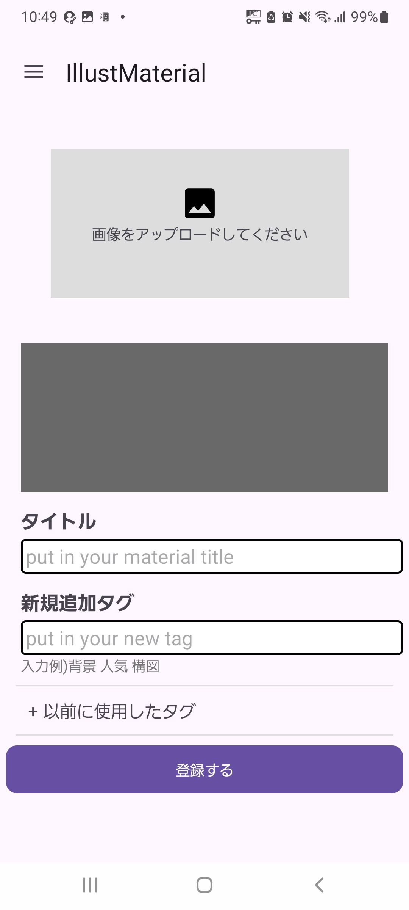
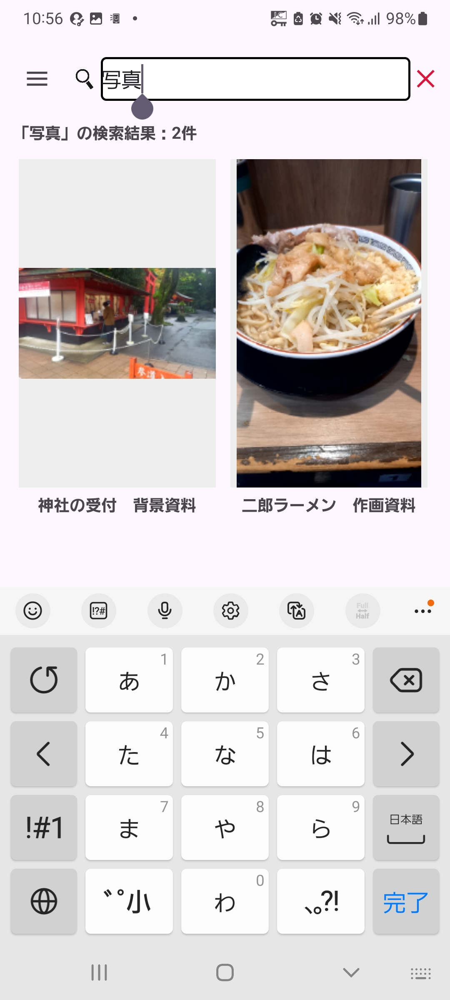
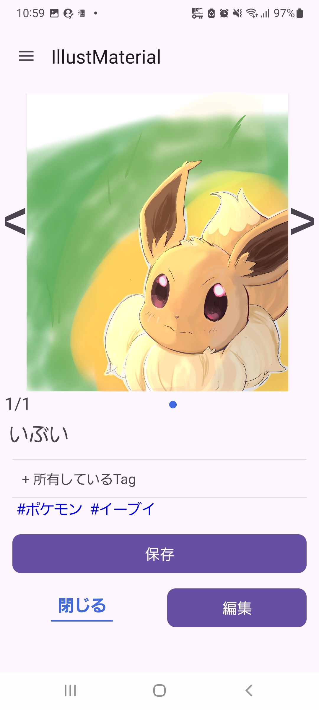

# イラスト資料管理アプリ

イラスト制作で使用する参考画像を、作品・タグ・タイトルごとに整理して検索できるAndroidアプリです。

## スクリーンショット

### 資料一覧

## 開発背景

自身のイラスト制作の際、参考にしたい画像をスマートフォンのギャラリーに保存していましたが、日常の写真と混在してしまい、必要な資料を探しにくいという問題がありました。

そこで、イラスト資料を通常の写真とは分けて保存し、タグやタイトルから必要な資料へすぐアクセスできるアプリを開発しました。

## 主な機能

* 複数画像を1つの資料として登録
* 資料へのタイトル設定
* タグ付け
* タイトル・タグによる検索
* 漢字の読みを利用した検索
* 登録済みタグの明確化
* 複数資料の選択
* 複数資料へのタグ一括追加
* 複数資料の一括削除
* 画像の拡大表示
* 複数画像の切り替え表示
* アプリ内部へのデータ保存
* 画像データのダウンロード/アップロード

## 使用技術

### Languages

* Java
* Kotlin
* XML

### Environment

* Android Studio

### Libraries

* PhotoView
* FlexboxLayout
* Kuromoji

### Data

* JSON
* Android Internal Storage

## アプリの構成

データ管理とUI処理を分けて実装しています。

主なデータ構造は以下の通りです。

* `DataList`：登録されている資料全体を管理
* `Img`：1つの資料と、それに所属する複数画像を管理
* `TagList`：タグの一覧を管理
* `Tag`：タグ名・使用回数・読みを管理
* `ReadingChanger`：Kuromojiを利用した読みの変換

## 工夫した点

### 複数画像を1つの資料として管理

1枚の画像を1つのデータとして扱うのではなく、関連する複数画像を1つの資料としてまとめて管理できるようにしました。

### タグによる資料検索

資料に複数のタグをユーザーに設定していただくことにより、必要な資料を検索できるようにしています。

また、Kuromojiを利用して読みを扱うことで、表記だけに依存しない検索を実装しています。

### 資料画像と通常の写真を分離

選択された画像をアプリ内部へ保存することで、スマートフォンの通常のギャラリーとは分離して資料を管理できるようにしています。

### 複数資料の一括操作

資料を複数選択するモードを実装し、タグ追加や削除などをまとめて実行できるようにしました。

###軽量化の実装

軽量化を実現するためにrecycleViewを利用しリストなどの大量の画像を読み込むページへの移動をより軽く実装しました。

###より扱いやすいアプリのためのレビュー

複数の友人からの意見を参考に、UIシステム面の両方で普段使い仕様になっております。

## 今後の実装予定

* イラスト依頼・制作物の締切管理
* リマインダー機能
* UI/UXの改善
* データ管理方式の改善
* クラウドを利用したデータ同期
* Windows版とのデータ共有

## 開発目的

本アプリは、自身がイラスト制作を行う際に感じていた「参考資料を探しにくい」という問題を解決することを目的として、個人開発しています。

単に機能を実装するだけでなく、実際に使用しながら問題点を発見し、機能追加やUI改善を繰り返しています。
